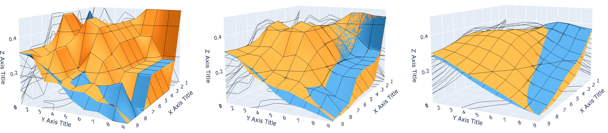
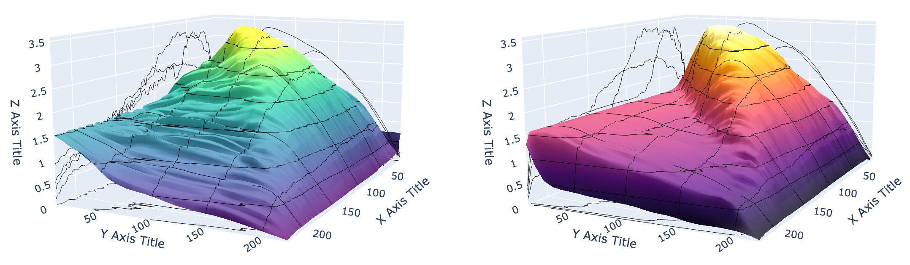

# 3D Surface Plot

Example of 3D surface plots with [`plotly`](https://plotly.com/python/).
See [live demo](https://seg-unibe.github.io/surface-plots/) to try it yourself.

https://github.com/user-attachments/assets/357fac2b-d11e-4a89-9c79-0cd0f1b8eebc

## Smoothing

## Color Scales

